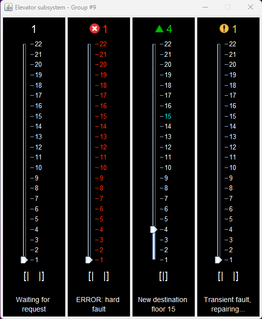

# Elevator Control System and Simulator 
Group 9 - Members: Vahid Foroughi, Noah Hammoud, Ilyes Hasnaou, Connor Marcus, Patrick Vafaie 

## Project Structure 
The project code is broken down into several packages for the different subsystems and components: 

### Elevator package
- `Elevator.java` represents the Elevator subsystem which communicates with the Scheduler to process elevator events.
- `ElevatorEvent.java` represents each text line from the input file as an object.
- `ElevatorRequest.java` represents a request from the Elevator to the Scheduler indicating it's ready to receive a FloorRequest. 
- `EleavtorResponse.java` represents a response object the elevator sends out to the scheduler after an event has occurred.
- `ElevatorState.java` represents the state of the elevator subsystem.

### Floor package
- `Floor.java` represents the floor subsystem which handles the parsing of the input file and communicating that with the Scheduler.
- `FloorRequest.java` represents a request made from the floor subsystem to the Scheduler.

### GUI package
- `ElevatorPanel.java` represents the JPanel used to model the graphical components of an Elevator.
- `GUI.java` represents the JFrame containing the complete GUI for the Elevator system.

### Scheduler package
- `Scheduler.java` represents the Scheduler subsystem which communicates with both the floor and elevator subsystems.
- `SchedulerReceivingState.java` represents the concrete state of the scheduler when it is only receiving requests.
- `SchedulerReceivingSendingState.java` represents the concrete state of the scheduler when it can receive and respond to requests
- `SchedulerState.java` represents the state of the Scheduler subsystem.

### Utils package
- `Time.java` represents the time stamp from the input file request in the following format: hh:mm:ss.mmm
- `UDPUtil.java` is a utility class for UPD-related functions such as: creating sockets, packets, sending and receiving packets, etc.


### Test package

- Contains all test classes associated with the project.

## Responsibilty Breakdown

### Iteration 5
- **Connor**: Interfaced existing Elevator system with the GUI, fixed bugs in GUI
- **Ilyes**: UML Class diagram, refactoring, JUnit test cases
- **Noah**: Added performance measuring capabilities to the Scheduler, ElevatorPanel.java
- **Patrick**: Timing diagrams for performance measurements, refactoring project structure
- **Vahid**: README, ElevatorPanel.java, GUI.java

### Iteration 4
- **Connor**: Added fault handling code to Scheduler, Elevator, ElevatorState, and updated elevator state machine diagram
- **Ilyes**: UML Class diagram, refactoring/testing, added additional code for faults
- **Noah**: Added fault handling code to Scheduler, Elevator, ElevatorState, ElevatorRequest
- **Patrick**: Timing diagram, sequence diagrams, refactoring, added additional code for faults
- **Vahid**: README, added Acknowledgements from Scheduler to Elevator and Floor, JUnit test cases

### Iteration 3
- **Connor**: UDPUtil.java, updated Scheduler, Elevator, and Floor
- **Ilyes**: UML Class diagram, updated Scheduler and Floor
- **Noah**: JUnit test cases, updated Scheduler, Elevator, and Floor
- **Patrick**: Sequence diagram, updated Scheduler, Elevator, and Floor
- **Vahid**: README, updated ElevatorState, ElevatorEvent, Floor, and Time

### Iteration 2
- **Connor**: SchedulerReceivingState.java, SchedulerReceivingSendingState.java, sequence diagram
- **Ilyes**: SchedulerState.java, refactoring, UML class diagram
- **Noah**: ElevatorState.java, state diagram, README
- **Patrick**: JUnit tests, refactoring, README
- **Vahid**: ElevatorState.java, state diagram

### Iteration 1
- **Connor**: Time.java, ElevatorResponse.java, FloorRequest.java and README.txt.
- **Ilyes**: JUnit testing, refactoring and UML Class diagram.
- **Noah**: Elevator.java, ElevatorEvent.java and README.txt
- **Patrick**: Floor.java, refactoring and FloorRequest.java.
- **Vahid**: Scheduler.java, Main.java and UML Sequence diagram.

## Error Handling

### Transient Faults 
Transient faults include events such as an elevator door failing to close. These types of faults are repaired and resolved by the elevator. Transient faults are encoded within the Fault column of the `floor_input.txt` as the number 1. Transient faults are shown in the GUI using the following [icon](Resources/images/transientFaultIcon.png).

### Hard Faults 

Hard faults include events such as an elevator loosing power. These types of faults cannot be repaired and cause the elevator to shutdown. Hard faults are encoded within the Fault column of the `floor_input.txt` as the number 2. Hard faults are shown in the GUI using the following [icon](Resources/images/hardFaultIcon.png) and by changing the colour of the elevator that encountered the hard fault to red. 

## Usage 

### Run the project in Eclipse:

1. Load the project into Eclipse using the provided zip inside the final submission zip. To do this click the "File" menu in Eclipse then click “Import”, and under the "General" folder select "Project from Folder or Archive". Now select the previously mentioned zip file from your file system and click “Finish”.

2. Once the project is loaded in Eclipse, it can be run by running the following files in this order: Scheduler.java, Elevator.java, and Floor.java in the "src" directory under the "com.sysc3303.project" package (each file contains a main method).

- The project can be run in that order on either 1 or 3 computers. If running on 3 different computers the IP addresses in Scheduler.java and Floor.java must be set (change the ADDRESS constants) to the corresponding computer's IP address. To get the IP address of the computer run the following commands:

  - **Windows:** get the Ipv4 address
    ```
    ipconfig /all 
    ```
  - **Mac:**
    ```
    curl ifconfig.me
    ```
- The number of elevators that are running can be changed by changing the NUM_CARS constant in Elevator.java.
- You can adjust the `floor_input.txt` file to simulate the different kinds of faults. 0 corresponds to no fault, 1 corresponds to a transient fault, 2 corresponds to a hard fault, and -1 corresponds to a shutdown event (this should only be used internally to indicate to the Elevator subsystem that the simulation is finished).

3. Once the project has been run, you should see output in the console and a GUI will appear corresponding to the events sent and received by the Elevator, Scheduler, and Floor subsystems.

### Run the JUnit test cases for the project:

1. Follow the previous steps to set up the project in Eclipse.

2. To run a single test case open the "com.sysc3303.project.test" package in the “src” directory then click on any JUnit Test Class. Now in the Drop down menu select Run > Run As > JUnit Test.

3. Alternatively, all the JUnit Test Classes can be run by right-clicking on the "com.sysc3303.project.test" package and selecting Run As > JUnit Test.

***NOTE:*** If you encounter an error when running the project or the test cases in Eclipse you may need to clean the project by selecting the menu Project > Clean.


## Sample Output

As shown below is the sample output of the Elevator system. The system is set with 4 elevators with 22 floors. An explanation of the elevator system is given from **left to right**: 
- Elevator is idle and waiting for a request
- Elevator has encountred a hard fault and is out of operation
- Elevator is processing a request and moving up towards the destination floor (highlighted in cyan)
- Elevator has encounted a transient fault and is reparing itself, after which it will continue processing requests



## Modifying Elevator System Output

`floor_input.txt` located within the [Resources folder](Resources/) contains the input requests read by the Floor subsystem (time, floor, floor button, car button, and fault). You should change [this file](Resources/floor_input.txt) if you wish to change the requests.
